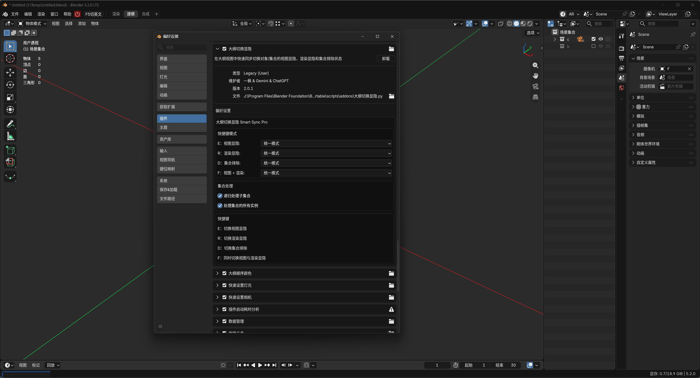

# 大纲切换显隐 (Outliner Smart Sync)

在大纲里管理显隐是个高频操作：批量开关要逐个点小眼睛图标，对象和集合混在一起时更繁琐；渲染显隐还得切到另一列，集合排除藏在 ViewLayer 选项里。

本插件把这一切搬到大纲键盘上：**选中后直接按键批量切换**——`E` 视图显隐、`R` 渲染显隐、`D` 集合排除、`F` 视图+渲染一起切，对象与集合混合多选一次搞定。

## 功能与快捷键

在大纲（Outliner）中选中对象或集合后：

| 按键 | 作用 |
| --- | --- |
| `E` | 切换视图显隐（视口中的眼睛） |
| `R` | 切换渲染显隐（渲染时的可见性） |
| `D` | 切换集合排除（仅对集合生效） |
| `F` | 同时切换视图显隐 + 渲染显隐 |

**两种切换模式**（每个按键可独立设置，默认统一模式）：

- **统一模式**：所有选中项按第一项的当前状态统一切换——适合"整体隐藏/显示一批"
- **逐项反转**：每个项目按自身状态各自反转——适合"显隐状态互补的一批"

**集合处理选项：**

- **递归处理子集合**：选中集合时连同所有子集合一起切换
- **处理集合的所有实例**：同一集合在当前 ViewLayer 中出现多次时，所有实例同时处理

所有操作支持 Blender 撤销（Ctrl+Z），无法处理的项目自动跳过并在状态栏提示。

## 安装

1. 在 [Releases](../../releases) 页面下载 `outliner_smart_sync-x.x.x.zip`
2. Blender → 编辑 → 偏好设置 → 获取扩展（Get Extensions）
3. 点击右上角下拉箭头 → 从磁盘安装（Install from Disk），选择 zip 并启用

> Blender 3.0～4.1（无扩展系统）：下载仓库中的 `__init__.py`，改名为 `outliner_smart_sync.py`，通过偏好设置 → 插件 → 安装（旧式插件）安装。

## 自定义

偏好设置（编辑 → 偏好设置 → 扩展 → 大纲切换显隐）中可修改：

- E / R / D / F 四个按键各自的切换模式（统一 / 逐项反转）
- 是否递归处理子集合
- 是否处理集合的所有实例

## 兼容性

- 代码支持 Blender 3.0 及以上
- 扩展方式安装需 Blender 4.2+

## 许可证

[GPL-3.0-or-later](LICENSE)
